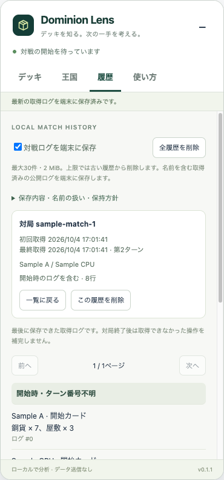

# Issue #11 履歴の検証

基点はmainの`df60dcecaf9a5b9795707c4a710befc7c30c63d4`。証拠は生成した匿名fixtureだけを使い、ユーザーの対局・名前・Chromeプロファイルを参照していません。

| 受け入れ条件 | 検証 |
| --- | --- |
| 終了後の日時・対局ID・ログ閲覧、再読込・ブラウザ再起動 | 実拡張を一時Chromeに読み込み、CPU・友達fixtureを保存。待機表示、ページ再読込、プロセスを終了して同じ一時プロファイルで再起動した後も履歴を閲覧 |
| 同一対局の重複防止、別対局の区別、途中記録 | 対局IDごとに上書き、複数のIDを個別に保存。開始カードがないfixtureには「途中から記録」を表示 |
| 巻き戻し後の有効なログ | 完全ログを短いログで置き換え、取消行がストレージと表示から消えることを確認。購入と獲得は所有枚数で二重計上しない |
| 容量・件数上限と保存失敗 | 31件で古い1件を削除、2 MiBを超える更新は保存前に拒否。合計容量による削除も確認。書き込み失敗を注入し、実UIが未保存を表示、前の保存内容を保持、再試行後に最新ログを保存 |
| 個別・全削除と保存無効 | 削除後・全削除後にChromeを再起動し、同じIDの更新を拒否。保存無効化と更新の競合、削除と遅延更新の競合も検証 |
| 公開情報のみ、名前の扱い、外部送信なし | 保存JSONに手札・ゾーン・認証情報・raw引数・任意metadataがないことを検証。名前とIDはHTMLエスケープ。権限はstorageのみ、送信API・公開機能を追加しない |
| README・使い方、レート戦停止 | 保存の初期状態・内容・上限・削除・名前・制約を更新。レート戦ではready情報も終了時の最終スナップショットも公開せず、記録しない |

`npm test`は70件成功・失敗0・skip 0。実ブラウザの検証はChrome 154の独立プロセスで実施。`npm run check`、`npm run package`、ZIPの整合性検査も成功しました。

待機画面から開いた匿名fixtureの履歴です。

## 残る制約

- ログインした実際のCPU戦・友達との対局は未検証。公開クライアント2.3.4のNEW_TURNが持つLoggedTurnと購入ログの構造を読み、匿名fixtureで検証しています。
- 保存するのは開始カード・購入・獲得・廃棄・交換・公開の受け渡しとターンの行です。使用・ドロー・チャットや非公開情報は保存しません。
- サイトが最終ログを破棄した場合やページを閉じていた間の操作は補完しません。保存日時は対局開始・終了日時ではなく取得日時です。
- 削除済み対局IDは復活防止のため保存し、2 MiB上限に含めます。IDだけで上限を使い切った場合は新規保存を拒否します。削除済みIDを自動で忘れる機能はありません。
- 保存履歴が破損・未対応形式の場合、上書きせず保存を停止し、再試行を案内します。
- 他の更新案内のIssueはこのPRの対象外です。拡張の再導入・削除を案内する場合は、端末の履歴が失われる説明との統合が必要です。
